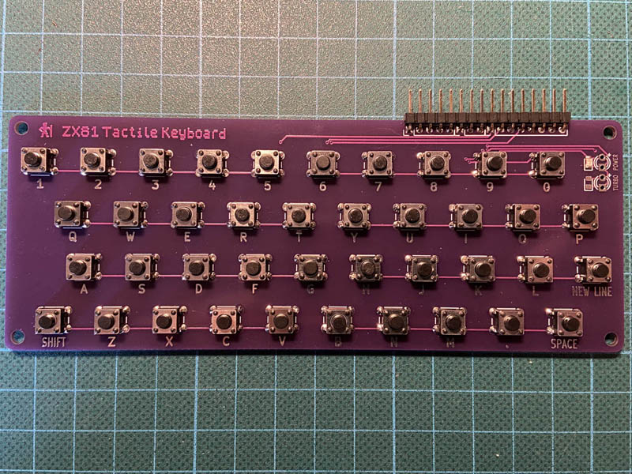

# ZX81 Tactile Keyboard

This is a PCB for a cheap and easy to build keyboard, designed to go with the [ZX81+38 replica board](https://github.com/mahjongg2/ZX81plus38).

See my [blog post](https://www.hackup.net/2022/01/building-a-new-zx81-computer/) for more details.

## License

This work is licensed under a
[Creative Commons Attribution-NonCommercial-ShareAlike 4.0 International License](http://creativecommons.org/licenses/by-nc-sa/4.0/).
